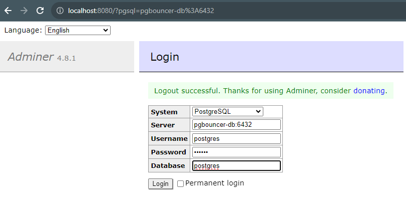

# Docker Compose Setup for PostgreSQL, PgBouncer, and Adminer

This repository contains a Docker Compose configuration that sets up a development environment with PostgreSQL, PgBouncer connection pooler, and Adminer database management tool.

## Prerequisites

- [Docker](https://www.docker.com/get-started)

## Getting Started

1. Clone this repository to your local machine:

   ```bash
   git clone https://github.com/HassanAbass/docker-pg-bouncer.git
   cd your-repo
   mkdir db-data
2. Start the services using Docker Compose:
   ```bash
   docker-compose up -d
## Testing
1. Using the terminal to access postgres through pg bouncer
    ```bash
   psql -h localhost -p 6432 -U postgres
   > insert password(secret)
1. Using Adminer(light DB management tool), open it using `8080` port [localhost:8080](`http://localhost:8080`)

   
